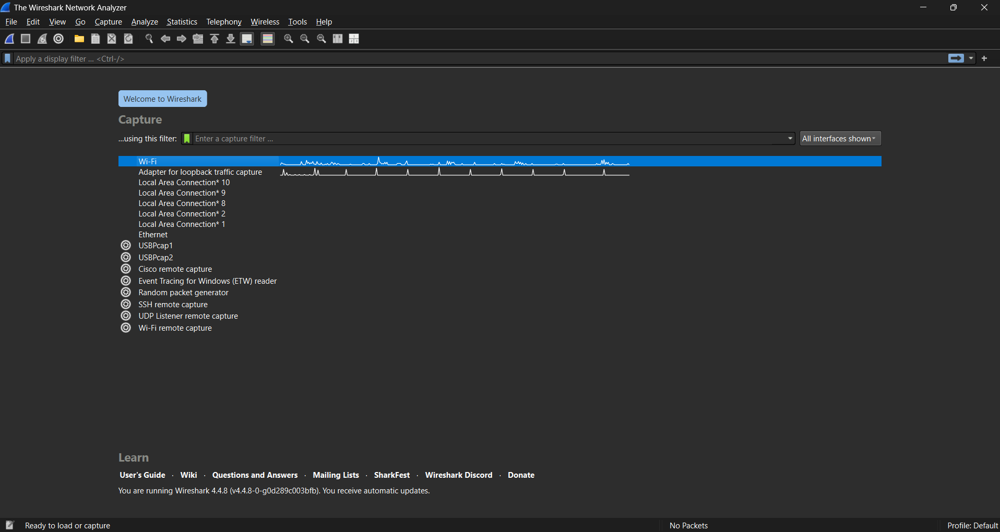
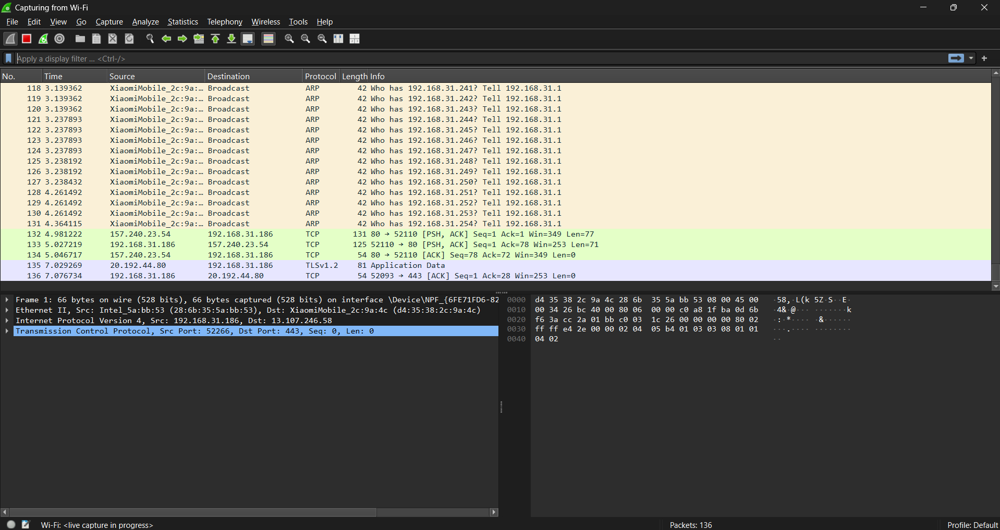
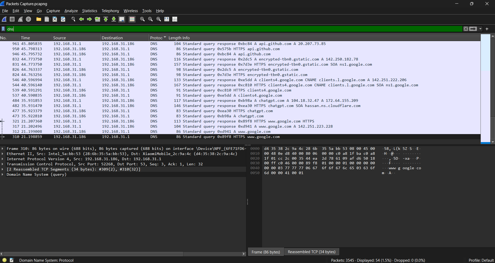
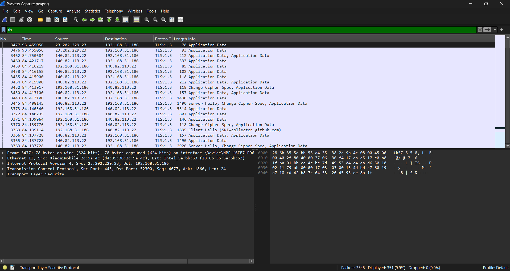
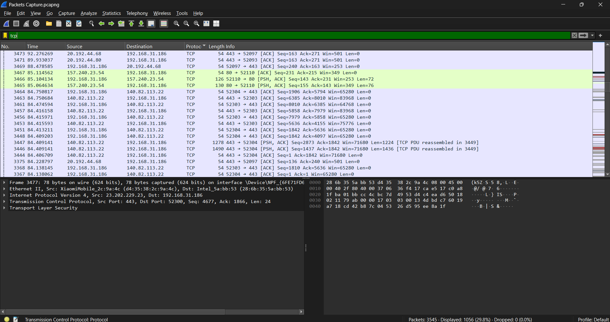
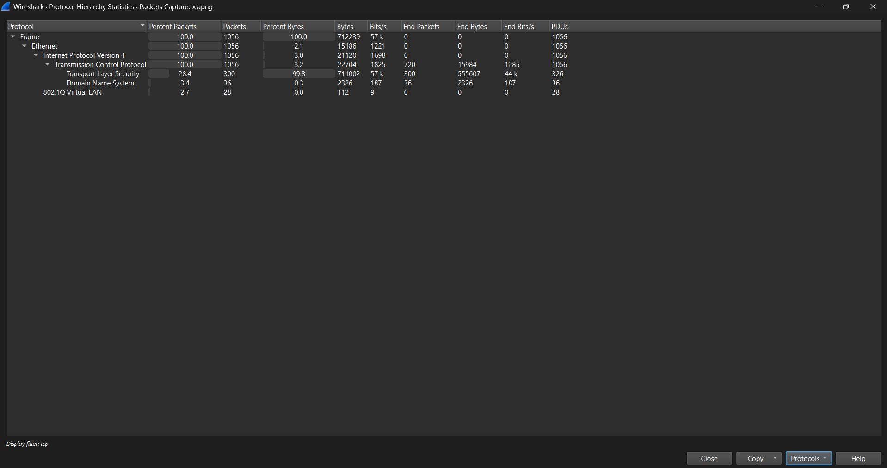

# Task 5 — Wireshark Network Traffic Capture

## Objective
Capture live network packets using Wireshark, identify multiple protocols, and analyze basic traffic types.

## Steps Performed
1. Installed Wireshark on Windows 11.
2. Started packet capture on the active network interface (Wi-Fi).
3. Generated traffic by:
   - Browsing websites (HTTPS/TLS)
   - Performing Google searches
   - Pinging servers (`ping google.com`)
4. Applied filters to focus on specific protocols.
5. Stopped capture and saved `.pcapng` file for analysis.

## Protocols Identified
- **DNS** — Resolves domain names to IP addresses.
- **TCP** — Ensures reliable, ordered data transfer between devices.
- **TLS** — Encrypts data for secure web communication (used by HTTPS).

## Observations
- Multiple **DNS queries** for domains visited during browsing.
- **TCP handshake** process visible (SYN → SYN-ACK → ACK) before TLS sessions.
- **TLS traffic** dominated packet count, indicating most websites use encrypted communication instead of plain HTTP.

---

## Screenshots

### 1. Selected Network Interface - Active Wi-Fi interface selected for packet capture.

  

### 2. Live Packet Capture Running - Packets scrolling in real-time during active capture.
  

### 3. DNS Filter Applied - Display filter `dns` showing only DNS query and response packets.
  

### 4. TCP Filter Applied - Display filter `tls` showing encrypted HTTPS web traffic.
  

### 5. TLS Filter Applied - Display filter `tcp` showing TCP traffic and handshake packets.
  

### 6. Protocol Hierarchy Statistics - Summary of all captured protocols with their percentages.
  

---

## Files
- `Packet Capture.pcapng` — Raw packet capture file.
- `/screenshots/` — All screenshots from the process.
- `README.md` — This report.

---

> Task successfully completed as part of the Elevate Labs Cyber Security Internship Program.
